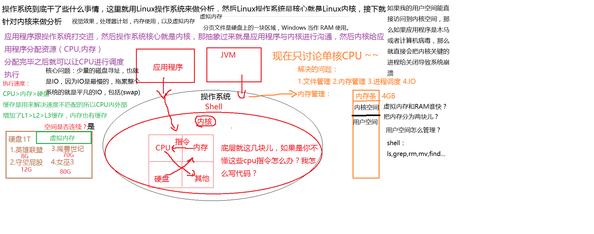

工程技术是任何人都可以替代的,要永远保持一颗谦逊的心,做工程人才是最厉害的.
# 01: 计算机组成原理, 操作系统

## 计算机

用电来替代数字0和1
电子管----------(遇到半导体,PN结,从而形成二极管)--------场效应晶体管-----------逻辑开关      
计算机通电--->cpu读取内存中程序(电信号输入)--->时钟发生器不断振荡通断电,给cpu的针脚通电传递0和1
 --->推动cpu内部一步一步执行(执行多少次取决于指令需要的时钟周期)---->计算完成--->写回(电信号)内存
 ---->写给显卡输出(sout,或者图形)

如何让计算机计算?
手工输入:纸带计算器,打点为1,不打为0
汇编语言:把一串0101..标识成助记符(mov ,add等),所以说汇编语言就是机器语言

量子计算机
量子比特:qb,那一位同时是1和0

## java相关硬件知识
cpu,内存   一般都是插到主板上
总线:系统总线,IO总线,内存总线

内存是cpu的仓库,只要一断电,内存就会恢复成初始状态   jvm将java编译后后的bytecode解释成机器码,给内存执行  

什么是32位和64位?   cpu一次能都读多少位0和1,即低电平和高电平

cpu的基本组成: 
   PC->指令寄存器,程序计数器,记录当前指令地址
   Registers->寄存器,暂时存储cpu计算机需要用到的数据，AX是16位，EAX是32位，RAX是64位的
   Alu->逻辑运算单元,做运算用的
   CU->控制单元
   MMU-<Memory Management Unit 内存管理单元\
   catch->解决速度不匹配的手段
   高速缓存：保存cpu的计算结果
   
   

超线程:一个ALu对应多个PC| Registers   所谓的四核八线程
由于os内核要进行内存管理，文件管理，进程调度，所以内核单进程固然是不可行的，所以内核也需要多进程。
核心线程数，一般是cpu的两倍 

线程切换的时候,会把上一个未执行完的的线程数据存放到缓存

由上面可以看出：多个cpu同时读取缓存行,如果一个cpu对x做了修改,另外一个cpu不能及时知道,伪共享
解决方法:
1:老的cpu使用总线锁,通过锁住系统总线,一个cpu访问l3的时候,另外的cpu不允许访问
2:各种各样的一致性协议  
现代CPU的数据一致性实现 = 缓存锁(MESI ...) + 总线锁

读取数据的时候是按块读取,程序的局部性原理,可以提高效率,充分发挥总线cpu针脚等一次性读取更多数据的能力
缓存一致性协议  inter的叫MESI Cache   cpu的每个cache line标记四种状态(额外两位)
锁总线 比一致性协议效率低,如果缓存行装不下

缓存行:
读取缓存以cache line为基本单位,缓存行一般是64字节,缓冲行越大,局部性空间效率越高,读取时间越慢,使用缓存行的对齐能够提高效率
--->对于有些特别敏感的数字,会存在线程高竞争的访问,为了保证不发生伪共享,
---->诞生了一种编程模式,叫做缓存行对齐,关键数据的前面有七个lang,后面有七个lang ,类似disuptor
---->在jdk8里面,可以使用@Contended,需要加上:JVM-XX:-RestrictContended 保证此数据不与其他数据在一个缓存行

## cpu的乱序执行, 目的是为了提高效率, 同时执行

概念:不需要等待上一条指令执行完成后才去执行第二条指令,如果两条执行没有依赖关系,两条指令会同时执行,第二条指令可能比第一条还要先完成
cpu层面如何禁止重排序?
--->内存屏障,对某部分内存做操作时前后添加的屏障,屏障前后的操作不可以乱序执行

cpu层面:Intel的cpu -> 原语(mfence读写屏障 lfence读屏障, sfence写屏障) 或者锁总线,volatile使用的是lock汇编指令,锁住一条内存总线
        使用原语肯定是比lock指令效率高,但是上面的原语只有inter有,其他cpu不一定有,但是lock指定很多cpu都有
JVm层面:8个hanppens-before原则 4个内存屏障 （LL LS SL SS）

注意:不管如何重排序,单线程执行结果不会改变,尽管可能会重排序, as if serial

### 合并写（不重要）
wc-Write Combining 合并写技术
由于ALU速度太快，所以在写入L1的同时，写入一个WC Buffer，满了之后(一般是4字节),再直接更新到L2

### NUMA

UMA：多个Cpu通过一条总线访问内存,不易扩展,cpu数量增多后引起内存访问冲突,4颗比较合适
NUMA:Non Uniform Memory Access 每个cpu优先访问自己插槽上的内存
ZGC - NUMA aware 

## os操作系统

os宏内核(kernel):文件系统,进程调度,中断管理设备驱动,cpu调度,内存管理
微内核:5G+万物互联,直接操作的就是应用管理进程调度,其他的都是间接管理,万物互联
外核 - 科研 实验中 为应用定制操作系统 (多租户 request-based GC JVM)

cpu分成ring0-->ring3级,linux只使用了其中的两个级别,ring0和ring3,访问权限不同
ring0 内核态 
ring3 用户态,对于系统的关键访问，需要经过kernel的同意，保证系统健壮性，用户空间无法访问内核空间。如果用户空间能直接访问到内核空间，如果应用程序是木马或者计算病毒，就直接会把内核关键的进程给关闭，导致系统关闭
内核执行的操作 - > 200多个系统调用 sendfile read write pthread fork 
JVM -> 站在OS老大的角度，就是个普通程序

### os进程调度
#### 进程 ,线程,纤程(协程),中端概念

操作系统统一调度cpu,内存,磁盘
应用架在操作系统上,C语言,JAVA
用户来操作应用

程序在操作系统中以进程的方式运行.
一个进程可以包含多个线程,进程是操作系统分配资源的基本单位,线程是cpu调度的基本单位.这里的资源指的是内存,虚拟内存等等
进程最重要的一块是ＰＣＢ，进程使用CPU的时间片

1:面试高频:进程和线程有什么区别?
普通回答:进程就是一个运行起来的状态,线程是一个进程中不同的执行路径.
专业答案:进程是os分配资源的基本单位,线程是执行调度的基本单位.分配的资源指的是:最重要的是独立的内存空间
         线程调度执行,没有自己独立的内存空间

2:线程在每个的操作系统中的实现都是不相同的,线程在Linux中的实现就是一个普通进程,只不过和其他进程共享资源
 （内存空间,资源数据,全局变量,数据段等).进程描述符：PCB（process Control Block）,线程也有自己的PCB
 其他系统都有各自的所谓LWP的实现Light Weight Process
高层次理解:一个进程中不同的执行路线

3:纤程(协程)Fiber:用户空间级别的的线程,jvm调度,在用户空间,切换和调度不需要经过操作系统
  优势:1:占有资源很少,4K,os线程在1M   2:轻量级,切换比较简单   3:可以启动很多个,10W个
  2020年3月22支持内置纤程能的语言:Kotlin,Scala,Go,paython+类库   
  java在类库Quaser级别支持,不是很成俗,openJDK有一个项目loom在做纤程的探索,jdk14暂时没有
纤程vs线程池:纤程适用于很短的计算任务,不需要和内核打交道,并发量高

4:内核线程:内核启动之后经常需要做一些后台操作,这些由Kernel Thread来完成,只在内核空间运行
          比如说计时

5:linu本身是c语言写的,进程创建,调用系统函数fork()来启动进程,系统函数是c语言对外提供的接口
  A fork() B,A叫做B的父进程,B叫做A的子进程
6:僵尸进程:父进程产生子进程后,会维护子进程的一个PCB结构,子进程退出,由父进程释放;如果父进程没有
          释放,那么子进程会成为一个僵尸进程.没有很大的影响,在内存中仅剩一个PCB   
  孤儿进程:子进程结束之前,父进程已经退出,孤儿进程会成为1457进程,1457是图形界面的进程,她的父亲是
           是1号进程init,由1号进程维护

#### 进程(任务)调度

1.进程被加载进去内存中，cpu是如何管理和执行进程的？
把cpu分成时间片，给每个进程一个较小的时间片，加载进内存中的进程创建PCB（PId,TGId进程主ID，FD文件描述符，进程的状态，上下文环境，寄存器的环境），
相当于文件的头部，PCB创建后进程会被放入一个就绪队列，os在cpu执行之前，会从就绪队列中随机选择一个未执行的队列扔给cpu执行，时间片用完后，
进程没执行完，继续扔进就绪队列。

2.发展过程
内核进程调度器决定,
1:进程调度的发展历程与发展算法:
1.1:从单任务(独占)到多任务(分时) .原则:最大限度的压榨cpu资源
1.2:多任务:现在大多采用抢占式
    非抢占式:除非进程主动让出cpu,否则将一直运行
    抢占式:由进程调度器强制开始或暂停(抢占)某一进程的执行
linux2.5采用经典O(1)调度策略,偏向服务器,但对交互(UI)不友好
linux2.6.23采用CFS完全公平调度算法:Completely Fail Scheduler,按优先级分配时间片的比例,
     记录每个进程的执行时间,如果有一个进程执行时间不到它应该分配的比例,优先执行.

3.进程分类和优先级:
3.1:进程类型:
    IO密集型:大部分时间用于等待IO
    CPU密集型：大部分时间用于闷头计算
3.2:进程优先级:
    实时进程(0-100)> 普通进程(-20-19)
3.3:时间分配:
    多采用按优先级的cpu分配时间片
3.4:调度策略(对于linux):除非实时进程主动退出,或者执行完毕后,普通进程才有机会进行
    对于实时进程:使用SChed_FIFO和Sched_RR两种
    对于普通进程:使用CFS

4:中断
硬中断:键盘,打印机
软中断:80中断,调用cpu函数   ,现在是汇编语言sysenter原语
      通过ax寄存器填入调用号,参数通过bx,cx,dx,si,di传入内核,返回值通过ax返回
      
5.线程（进程）上下文切换：线程德创建和销毁
    进程上下文切换：需要保护现场（把pc计数器存储，以便知道指令执行到了哪一步；文件描述符，将进程状态设置为阻塞态）和恢复现场 ，需要消耗系统资源，会导致卡顿，或者半天出不来。所以人们发明了线程这种轻量级的东西。线程也就成了cpu和内核调度的基本单位。cpu把时间片给内核线程，内核线程再把时间片分配给进程，进程中有一个总控，ProcessThread线程库，线程库根据时间片调度线程。线程的上下文切换比进程代价好的多，但是在Java中，代价还是很大的，所以要尽量避免上下文切换

6.线程之间共享进程的资源是通过什么方式来共享的？
  通过内存共享， 
          

### os内存分配
#### 内存管理

1:点击程序到被加载的大致过程：
用户双击程序，产生了一个事件，操作系统监听了这个事件，os就会发一个请求指令，中断信号给cpu,cpu通过指令的
操作数和操作码了解，并返回一个操作码（指令）给os内核，让其调度IO系统，调动磁盘驱动器，通过通过磁头找到柱面，
再找磁道，再找扇区，从而找到程序才磁盘上的位置。

虚拟内存：磁盘寻址

2.发展过程
DOS时代:同一时间只能由一个进程运行(也有一些特殊算法可以支持多进程)
windows9X:多个进程装入内存 1:内存不够用,  2:互相打扰
为了解决这两个问题,诞生了现在的内存管理系统:虚拟地址  分页装入  软硬件结合寻址
解决内存撑爆问题:
内存中分成固定大小的页框(4K),把程序(硬盘上)也分成4K大小的块,用到那一块,加载那一块
局部性原理:时间局部性-指令旁边的指令很快运行     空间局部性-数据交换的数据很快用到
内存满了,进行交换分区(LRU算法 Least Recently Used 哈希表+双向链表):把最不常用的一块放到swap分区,把最新的一块加载进来
相互打扰问题:使用虚拟内存解决
 1:LDOS win31  ...进程相互干掉
 2:为了保障互不影响,让进程工作在虚拟内存,程序中用到的空间地址不再是直接的物理地址,而是虚拟的地址,这样,
   A进程永远不可能访问B进程的内存空间
 3:虚拟空间的大小:须知空间与计算机的位数相关: 64位系统,2^64位byte,比物理内存大很多
   站在虚拟的角度,进程是独享整个系统+CPU
 4:内存映射:偏移量+段的基地址=线性地址(虚拟空间)
           OS+MMU(硬件Memory Management Unit)处理线性地址得到物理地址
  所以,站在用户的角度根本就不知道进程在内存中的物理地址到底在那,只有os内核知道
 5:缺页中断:需要的页面内存中没有,产生缺页中断(异常),os通过虚拟内存(页表)去硬盘中去加载
 
 
 
3：内碎片和外碎片，及如何解决
两个程序之间的碎片叫做外碎片
内碎片:程序分段,一段内存多大,比如100M,一个250M的程序 显然要占用三块,导致50M的内存浪费.
地址转换器，将程序分段，可是使用不连续的内存空间，避免外碎片的产生
静态分配,动态分配产生外碎片   分段产生外碎片
分页机制使得内存分的更小了,很好的忽略内碎片和外碎片  在linux中,通常每一页的大小都为4KB  需要cpu硬件支持
操作系统为每一个程序都维持了一个页表

 

4：如何把16G的文件加载到4G的内存中?
引出了虚拟内存.每一个程序都给它完全的需要需要的空间大小,
程序在磁盘上,加载的时候会在磁盘上弄一个swap分区(磁盘虚拟内存),会首先把必要的代码段和程序段数据加载到内存中,这会产生一个物理地址,即
程序在磁盘上的地址,即虚拟地址,即程序在内存上的地址,页表来保存这种映射关系.当控制单元需要一块数据时,会通知ＭＭＵ，给他虚拟地址，ＭＭＵ将这个
虚拟地址转化为物理地址，去内存中寻找．如果找不到，会去内存的三级缓存中寻找，如果还找不到，就会产生中断，ＭＭＵ通知控制单元，控制单元通知操作系统内核，
首先去ｓｗａｐ分区去寻找，如果没有，ｓｗａｐ会去程序中加载，逐级返回．

#### ZGC

算法叫做:Colored Pointer   64位机器支持
GC记录在指针上,不会记录在头部,42位指针,寻址空间 2^42=4T   jdk13位16T,目前最大就是16T

cpu如何区分一个立即数和一条指令
总线分为:数据总线   地址总线   控制总线
目前地址总线:做主板的一般给64位机少了16根总线,目前只有48位,4位给了颜色指针(标记对象的不同状态),所以只剩下44位的寻址空间
     颜色指针本质上包含了地址映射的概念

### 内核同步知识（了解）条件:
#### 关于同步理论的一些基本概念

临界区:访问或操着共享数据的代码段  简单理解:synchronized大括号部分(原子件)
竞争条件(race conditions):两个线程同时拥有临界区的竞争权
数据不一致:由竞争条件引起的数据破坏
同步:(synchronized)避免race conditions

