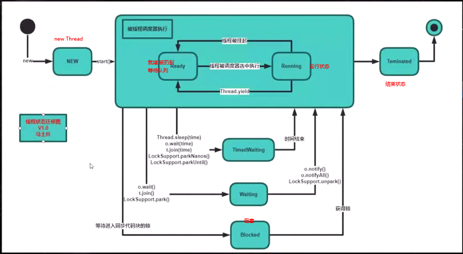
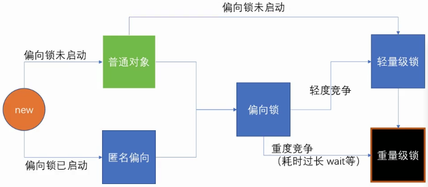
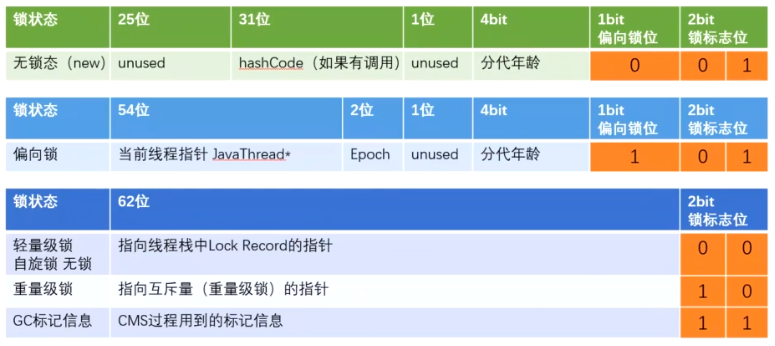

# 1-线程基础知识
## 1.1：线程开启的三种方式
a：T1  Extends Thread     重写run()方法          
       new T1().start();
b：T2  Implements Runnable     重写run()方法     
      new Thread(new T2()).start();      
c：通过线程池以及lanada表达式来启动（严格来说也是上面的两种）

## 1.2：线程的状态
 


就绪和运行状态一起被叫做Runable状态
加上同步代码块,没有得到锁,进入阻塞状态,获得锁,进入就绪状态
在运行的时候,调用wait(),join(),进入等待状态,调用notify(),notifyAll()进入就绪状态
在运行的时候,调用sleep(),进入TomeWaiting状态,到期以后进入ready状态等待分配时间片执行
yield执行后线程进入就绪状态,但礼让不一定都能礼让成功(即让其他线程先执行)，而是由CPU决定
从运行到就绪,被挂起
stop()强制关闭,不建议使用
如果一个线程长时间运行,可以用interrupt(),在sleep的时候catch异常
getState():取得线程状态

## 1.3的一些方法
sleep():沉睡,让出cpu,时间到了回到就绪状态
yield():从就绪状态返回到等待队列,让出一下cpu
join（）方法：t2.join()->让t2运行,一般都是等待某一个线程结束线程join进来后，后面的方法就不能并发执行了

 
 
#2-synchronized
## 2.1:synchronized的原理
JDK早期，synchronized 叫做重量级锁， 因为申请锁资源必须通过kernel, 系统调用

查看字节码可以得知：
synchronized（由两部分组成：一个monitorenter监视器进入   两个monitorexit监视器退出）
重要：为什么两个监视器退出：原因在于：一个是同步完成后正常退出，一个是出现了异常后释放锁，如果不释放可能会导致死锁

## 2.2:synchronized的常识
a:syncyronized锁住的不是方法而是对象（this/xxx.class），锁定方法和非锁定方法可以同时执行。
b:synchronized(object),锁定对象一般用object，不要使用String常量和基本数据类型。
c:synchronized是可重入的，可以再次获取同一个对象的锁，计数加1.
d:synchronized是比较安全的，在加锁代码中如果发生了异常，会自动释放占有的锁，不会导致死锁。
e:一般使用了synchronized，就不需要volatile,synchronized保证原子性和一致性，而volatile只保证一致性，不保证原子性。所以volatile一般加在变量上
f:锁定某对象o，如果o的属性发生改变，不影响锁的使用；但是如果o变成另外一个对象，则锁定的对象发生改变。
  应该避免将锁定对象的引用变成另外的对象，给要加锁的对象加上final关键字
g:加在静态方法上，那么我们在字节码中无法看到它锁了，实际上它默认是锁了整个类，也就是class

##2.3:synchronized的膨化
在很早之前的jdk中，synchronized是重量级的，它是直接对操作系统申请资源（内核态）；
jdk1.5之后,jdk对synchronized进行了优化。
新创建的对象处于无锁状态，线程在访问synchronized标识的对象的时候，对象头部中markword有两个字节记录这个线程ID，记录是否加了锁，加了什么类型的锁。
如果markword 中只有一个线程ID，说明不存在竞争，此时为偏向锁（用户态-)----->当有线程再次访问对象时，则markword 中会再次记录一个线程的ID，
此时存在了线程争用，这两个个线程在自己的线程栈里面生成一个lr(lock record)锁纪录，然后以自旋的方式把自己的lr指针写到对象的makrkdown里，一旦一个写入，
另外一个只能自旋等待，此时synchronized会升级为自旋锁，也叫轻量级锁，自旋锁占用cpu，但不访问操作系统，效率比较高（用户态），一般默认自旋10以后，
自旋锁升级为重量级锁，直接访问操作系统，比较笨重(内核态)。

##2.4对象上锁的过程
**       **
new - 偏向锁 - 轻量级锁 （无锁, 自旋锁，自适应自旋）- 重量级锁



用markword中最低的三位代表锁状态 其中1位是偏向锁位 两位是普通锁位



###2.4.1:对象上锁具体分析
>如果偏向锁打开，默认是匿名偏向状态;如果未打开，是普通对象
>偏向锁默认打开,但是有个时延，-XX:BiasedLockingStartupDelay=0   延时4秒
 原因：因为JVM虚拟机自己有一些默认启动的线程，里面有好多sync代码，这些sync代码启动时就知道肯定会有竞争，如果使用偏向锁，
      就会造成偏向锁不断的进行锁撤销和锁升级的操作，效率较低。
> 如果设定上述参数,new Object () - > 打开偏向锁，new出来的对象，默认就是一个可偏向匿名对象101
>如果有线程上锁->上偏向锁，指的就是，把markword的线程ID改为自己线程ID的过程;偏向锁不可重偏向 批量偏向 批量撤销
>如果有线程竞争:撤销偏向锁，升级轻量级锁,线程在自己的线程栈生成LockRecord ，用CAS操作将markword设置为指向自己这个线程的LR的指针，设置成功者得到锁
>如果竞争加剧：有线程超过10次自旋， -XX:PreBlockSpin(1.6之后不用调了，默认开启)， 或者自旋线程数超过CPU核数的一半， 1.6之后，
  加入自适应自旋 Adapative Self Spinning ， JVM自己控制
  注意：自适应自旋锁意味着自旋的时间（次数）不再固定，而是由前一次在同一个锁上的自旋时间及锁的拥有者的状态来决定。如果在同一个锁对象上，
       自旋等待刚刚成功获得过锁，并且持有锁的线程正在运行中，那么虚拟机就会认为这次自旋也是很有可能再次成功，进而它将允许自旋等待持续相对更长的时间。
       如果对于某个锁，自旋很少成功获得过，那在以后尝试获取这个锁时将可能省略掉自旋过程，直接阻塞线程，避免浪费处理器资源。
>升级重量级锁：-> 向操作系统申请资源，linux mutex , CPU从3级-0级系统调用，线程挂起，进入等待队列，等待操作系统的调度，然后再映射回用户空间
  (以上实验环境是JDK11，打开就是偏向锁，而JDK8默认对象头是无锁)

### 2.4.2：注意点
**如果计算过对象的hashCode，则对象无法进入偏向状态！**
> 轻量级锁重量级锁的hashCode存在与什么地方？
> 答案：线程栈中，轻量级锁的LR中，或是代表重量级锁的ObjectMonitor的成员中

关于epoch: (不重要)
> **批量重偏向与批量锁撤销**渊源：从偏向锁的加锁解锁过程中可看出，当只有一个线程反复进入同步块时，偏向锁带来的性能开销基本可以忽略，
>但是当有其他线程尝试获得锁时，就需要等到safe point时，再将偏向锁撤销为无锁状态或升级为轻量级，会消耗一定的性能，所以在多线程竞争频繁的情况下，
>偏向锁不仅不能提高性能，还会导致性能下降。于是，就有了批量重偏向与批量撤销的机制。

> **原理**以class为单位，为每个class维护**解决场景**批量重偏向（bulk rebias）机制是为了解决：一个线程创建了大量对象并执行了初始的同步操作
>，后来另一个线程也来将这些对象作为锁对象进行操作，这样会导致大量的偏向锁撤销操作。
>批量撤销（bulk revoke）机制是为了解决：在明显多线程竞争剧烈的场景下使用偏向锁是不合适的。

> 一个偏向锁撤销计数器，每一次该class的对象发生偏向撤销操作时，该计数器+1，当这个值达到重偏向阈值（默认20）时，JVM就认为该class的偏向锁有问题，
>因此会进行批量重偏向。每个class对象会有一个对应的epoch字段，每个处于偏向锁状态对象的Mark Word中也有该字段，其初始值为创建该对象时class中的epoch的值。
>每次发生批量重偏向时，就将该值+1，同时遍历JVM中所有线程的栈，找到该class所有正处于加锁状态的偏向锁，将其epoch字段改为新值。
>下次获得锁时，发现当前对象的epoch值和class的epoch不相等，那就算当前已经偏向了其他线程，也不会执行撤销操作，而是直接通过
>CAS操作将其Mark Word的Thread Id 改成当前线程Id。当达到重偏向阈值后，假设该class计数器继续增长，当其达到批量撤销的阈值后（默认40），
>JVM就认为该class的使用场景存在多线程竞争，会标记该class为不可偏向，之后，对于该class的锁，直接走轻量级锁的逻辑。

##2.5:关于synchronized的讨论
**为什么有自旋锁还需要重量级锁？**
> 自旋是消耗CPU资源的，如果锁的时间长，或者自旋线程多，CPU会被大量消耗。执行时间短（加锁代码），线程数少，用自旋锁
> 重量级锁有等待队列，所有拿不到锁的进入等待队列，不需要消耗CPU资源，执行时间长，线程数多，用系统锁

**偏向锁是否一定比自旋锁效率高？**
> 不一定，在明确知道会有多线程竞争的情况下，偏向锁肯定会涉及锁撤销，这时候直接使用自旋锁
> JVM启动过程，会有很多线程竞争（明确），所以默认情况启动时不打开偏向锁，过一段儿时间再打开
>偏向锁由于有锁撤销的过程revoke，会消耗系统资源，所以，在锁争用特别激烈的时候，用偏向锁未必效率高。还不如直接使用轻量级锁。

**锁重入**
>sychronized是可重入锁
>重入次数必须记录，因为要解锁几次必须得对应
>偏向锁 自旋锁 -> 线程栈 -> LR + 1   如果加了可重入锁，那么会在线程栈再生成一个lr，是空的，解锁的时候弹出，弹完lr锁就解了
>重量级锁 -> ? 会记录在ObjectMonitor字段上

**超线程**
>一个ALU + 两组Registers + PC


#3-volatile
2：锁优化一般分两种
     锁细化：同步代码块中语句越少越好，只在必要同步的代码上加锁
     锁粗化：代码中加了多个细锁，不如在大块中加锁，减少代码争用
3：但是效率问题还是可以使用更好的方法解决。比如使用volatile和CAS，也叫无锁，至于具体到底是不是锁，个人理解就好。

## 1.1：保证线程间变量的可见性
会让所有线程会读到变量的修改值。线程共享堆内存，但每个线程都有一份自己的内存。当有两个线程访问堆内存中的变量的时候，都会先copy一份到自己的内存中，
线程一对这个变量做了改变，首先是在自己的内存中修改，至于这个变量的修改什么时候写回到堆内存，不好控制。（此时变量已经做了修改），
线程二此时读到的变量值仍是初始值，线程一对变量做出的改变并不能及时在线程二中体现。**加了volatile，使用了cpu的缓存一致性协议（MESI），保证可见性**。

## 1.2：禁止指令重排序
以前的指令是顺序加载到cpu中，一步一步的执行。但是现在的cpu为了提高效率，会将指令并发的执行。比如第一条指令执行到一半的时候，
第二条指令就已经开始执行了，第三条指令也开始了（流水线式的执行）。

## 1.3：缺点:只能保证可见性却不能保证原子性
**有两个方法解决：
aa：给count++;语句加锁，synchronized可以保证原子性，但效率降低，不过这里验证了volatile不能替代synchronized
bb：使用CAS**、
**cc**：使用专门解决整数问题的类**LongAdder(用了分段锁，分段锁也是CAS操作)**

## 1.4：讨论
### 系统底层如何实现数据一致性 
    1. MESI如果能解决，就使用MESI
    2. 如果不能，就锁总线
    
### 系统底层如何保证有序性 
    1. 内存屏障sfence mfence lfence等系统原语
    2. 锁总线
    
### volatile如何解决指令重排序
    1: volatile i
    2: ACC_VOLATILE
    3: JVM的内存屏障


# 4-CAS
## 2.1：CAS简介
CAS又叫做自旋锁，乐观锁：无锁优化，在JVM层面上没有加锁，但是在cpu层还是加锁了，是CPU的原语支持。通过lock cmpxchg指令来完成，
lock指令在执行后面指令的时候锁定一个北桥信号（不采用锁总线的方式），在cas比较完成然后将新值写入的时候加锁了。

## 2.2： CAS原理
 （Compare And Set） 
 有三个值：要修改的值（V1），预期值（V2），设定的新值 （P） 。只有当V1=V2时，才将V1的值改为P的值
 
## 2.3：CAS造成的ABA问题
ABA问题，你的女朋友在离开你的这段儿时间经历了别的人，自旋就是你空转等待，一直等到她接纳你为止
**解决方法：
aa：给每一版数据加上版本号AtomicStampedReference，比较的时候不仅比较数据，还比较版本号，，基础类型简单值不需要版本号
bb：原子类中有AtomicStampedReference类专门解决ABA问题**

## 2.4：原子类（AtomXXX类）
比较常见的是AtomInteger类，实现原理使用了CAS。原子类中的Compare And Set是在Unsafe这个类（等同于c,c++指针）中执行的，这个类是单例模式实现的。
jdk8是不能直接调用getUnsafe（）方法，使用这个对象的。但在jdk11是可以直接调用的，而且将Compare And Set改成了WeakCompare And Set，加强了垃圾回收的机制。


# 5：AQS
## 5.1AQS介绍
 AQS是AbstractQueuedSynchronizer的简称。
    **有一个共享资源变量state：AQS state是一个volatile标志的Int整形数，支持多线程下的可见性**。根据子类取不同的意义。
     例如：
    ReentranLock底层的state如果是1，表示当前线程已经获取锁；从1升到2，表示加了可重入锁，又加了一次；如果state是0,表示已经释放锁。
    CountDownLatch底层的state表示需要countdown的次数。
**跟随着state的还有一个FIFO等待队列，是一个双向链表，一个节点中表示一个线程，有前节点，后节点。多线程竞争state被阻塞会进入此队列，实现方式为CAS**。
当等待队列中的一个节点拿到了state的值，就相当于节点中的线程拿到了锁。上面解释了为什么**AQS=CAS+Volatile**

## 5.2AQS源码分析
具体的源码实现大家可以自行阅读，但是阅读源码是很辛苦的,一般遵循跑不起来不读，解决问题就好（目的性），一条线索到底，无关细节略过，一般不读静态，一般动态读法，读源码先读框架等。
[https://www.jianshu.com/p/0f876ead2846](https://www.jianshu.com/p/0f876ead2846)  -浅谈Java的AQS
下面是我对AQS的一些认识（只涉及独占式获取资源），如何获取锁：

```java
//这里是获取锁的acquire(1)方法
public final void acquire(int arg) {
    if (!tryAcquire(arg) &&
        acquireQueued(addWaiter(Node.EXCLUSIVE), arg))
        selfInterrupt();
}
```
首先尝试获取锁，进入tryAcquire(1)方法，进入到

继续跟，进入到


这里首先会先会获取当前线程以及获取资源state，用c表示
如果c==0，用cas方式加锁；
如果c!=0，说明锁已被线程占用，但是加锁线程是当前线程，将加1，表示为可重入锁
其他的表示没有获取到锁，会进入到等待队列中，调用`acquireQueued(addWaiter(Node.EXCLUSIVE), arg))`

先看addWaiter(Node.EXCLUSIVE), arg)方法，将当前线程加入到等待队列中

```java
private Node addWaiter(Node mode) {
    Node node = new Node(Thread.currentThread(), mode);
    // 尝试将节点快速插入等待队列尾端
    Node pred = tail;
    //如果当前节点（线程）前面没有节点了，将当前节点表示为头结点
    if (pred != null) {
        node.prev = pred;
        //采用CAS方式，只关注尾节点，代替了原始锁住整个链表的方式，提高效率。
        if (compareAndSetTail(pred, node)) {
            pred.next = node;
            return node;
        }
    }
    // 常规插入
    enq(node);
    return node;
}
```
然后在等待队列中尝试获取锁

```java
final boolean acquireQueued(final Node node, int arg) {
    // 标识是否获取资源失败
    boolean failed = true;
    try {
        // 标识当前线程是否被中断过
        boolean interrupted = false;
        // 自旋操作
        for (;;) {
            // 获取当前节点的前继节点
            final Node p = node.predecessor();
            // 如果前继节点为头结点，说明排队马上排到自己了，可以尝试获取资源，若获取资源成功，则执行下述操作
            if (p == head && tryAcquire(arg)) {
                // 将当前节点设置为头结点
                setHead(node);
                // 说明前继节点已经释放掉资源了，将其next置空，以方便虚拟机回收掉该前继节点
                p.next = null; // help GC
                // 标识获取资源成功
                failed = false;
                // 返回中断标记
                return interrupted;
            }
            // 若前继节点不是头结点，或者获取资源失败，
            // 则需要通过shouldParkAfterFailedAcquire函数
            // 判断是否需要阻塞该节点持有的线程
            // 若shouldParkAfterFailedAcquire函数返回true，
            // 则继续执行parkAndCheckInterrupt()函数，
            // 将该线程阻塞并检查是否可以被中断，若返回true，则将interrupted标志置于true
            if (shouldParkAfterFailedAcquire(p, node) &&
                parkAndCheckInterrupt())
                interrupted = true;
        }
    } finally {
        // 最终获取资源失败，则当前节点放弃获取资源
        if (failed)
            cancelAcquire(node);
    }
}
```

## 5.3：AQS的一些实现类
### 5.3.1：Reentranlock
可重入锁：synchronized方法是可以调用    
    synchronized方法的代替synchronized,Lock lock=new ReentrantLock(); lock.lock();   
    lock.unlock();Synchronized是自动解锁的，但lock却不是手动解锁的，要在finally块中解锁。
    同时：可以传递参数为true，公平锁，按照等待顺序执行，会检查等待队列是否为空。 
    可以进行tryLock，synchronized拿不到锁会直接进入阻塞状态还可以lockinterupptibly（被打断）。
### 5.3.2:CountDownLatch
倒数的门栓：等着多少个线程结束才开始执行，latch.wait();  latch.countdown();
### 5.3.3：CycilcBarier
 栅栏，达到多少线程数才开始发车
### 5.3.4：Phase
  按照不同的阶段对线程开始执行
### 5.3.5：ReadWriteLock
  读写锁，共享锁和排它锁。读锁，允许读，不    允许写；写锁，读写都不允许。
### 5.3.6：Semaphore
 信号量，限流，必须先获得许可，允许多少个线程同时进行，比如车道和收费站
### 5.3.7：Exchanger
  交换数据，线程一执行exchange方法阻塞，将值T1保存；线程二执行exchange方法，将值T2保存，进入阻塞；T1与T2交换值，两个线程继续往下跑。
### 5.3.8：LockSupport
  锁支持，LockSupport.park();是当前线程阻塞   LockSupport.unpark();解封，使线程继续运行，onpack可以现在pack之前调用，
  用来代替wait和notify，更灵活，可以唤醒特定的线程。底层是是unsafe的park方法。
  
  
  
# 6：VarHandle
上一篇说了AQS的源码，其中还有一个知识点VarHandle，看下面的代码

大家会问：VarHandle是什么？有什么作用？
其实：**VarHandle是jdk1.9之后才出现的，表示指向某个变量的引用，可以完成原子性的线程安全操作可以通过cas方式进行比较设值。比反射快，直接操纵二进制码，反射每次操作前都要做检查**

## 6.1：强软弱虚引用
博客部分内容引用：[http://blog.csdn.net/liuxian13183](http://blog.csdn.net/liuxian13183)
 ## 6.1.1. 强引用
Object object=new Object（）；那object就是一个强引用了。如果一个对象具有**强引用，那就类似于必不可少的生活用品，垃圾回收器绝不会回收它。
当内存空间不足，Java虚拟机宁愿抛出OutOfMemoryError错误，使程序异常终止，也不会靠随意回收具有强引用的对象来解决内存不足问题**。
   
 ## 6.1.2. 软引用（SoftReference）
 如果一个对象只具有**软引用，那就类似于可有可物的生活用品。如果内存空间足够，垃圾回收器就不会回收它，如果内存空间不足了，就会回收这些对象的内存**。
 只要垃圾回收器没有回收它，该对象就可以被程序使用。软引用**可用来实现内存敏感的高速缓存。软引用可以和一个引用队列（ReferenceQueue）联合使用**，
 如果软引用所引用的对象被垃圾回收，Java虚拟机就会把这个软引用加入到与之关联的引用队列中。
  
 ## 6.1.3. 弱引用（WeakReference）
 **一般用在容器里WeakHashMap 还有ThreadLocal**  。 如果一个对象只具有弱引用，那就类似于可有可物的生活用品。弱引用与软引用的区别在于：
 只具有弱引用的对象拥有更短暂的生命周期。在垃圾回收器线程扫描它所管辖的内存区域的过程中，**一旦发现了只具有弱引用的对象，不管当前内存空间足够与否，都会回收它的内存**。
 不过，由于垃圾回收器是一个优先级很低的线程， 因此不一定会很快发现那些只具有弱引用的对象。**弱引用可以和一个引用队列（ReferenceQueue）联合使用**，
 如果弱引用所引用的对象被垃圾回收，Java虚拟机就会把这个弱引用加入到与之关联的引用队列中。
   
## 6.1.4. 虚引用（PhantomReference）：管理堆外内存  
 "虚引用"顾名思义，就是形同虚设，与其他几种引用都不同，虚引用并不会决定对象的生命周期。**如果一个对象仅持有虚引用，那么它就和没有任何引用一样，
 在任何时候都可能被垃圾回收。虚引用主要用来跟踪对象被垃圾回收的活动。虚引用与软引用和弱引用的一个区别在于：虚引用必须和引用队列（ReferenceQueue）联合使用。
 当垃圾回收器准备回收一个对象时，如果发现它还有虚引用，就会在回收对象的内存之前，把这个虚引用加入到与之关联的引用队列中。
 程序可以通过判断引用队列中是否已经加入了虚引用，来了解被引用的对象是否将要被垃圾回收**。程序如果发现某个虚引用已经被加入到引用队列，
 那么就可以在所引用的对象的内存被回收之前采取必要的行动。**NIO里面的PirectByteBuffer指向堆外内存，被称为直接内存，由操作系统管理，GC无法直接回收
 。所以要用到虚引用，当直接内存需要被回收的时候，通过引用队列进项检测，进而清理掉。C或C++虚拟机，采用delete或free。Java可以采用的是UnSafe类中的freeMemory()进行回收**。


# 7：ThreadLocal
## 7.1：线程本地
别的线程无法访问到
## 7.2：原理
**set（）源码：Set的时候设到了当前线程的map中，其他线程是读不到的
map不为空：Thrad.currentThread.map(ThreadLocal，valve)
Map等于空：初始化map**
## 7.3：ThreadLocal与弱引用的配合使用,解决内存泄露
**ThreadLocal的map中的entry是弱引用**

1:解决的内存泄漏问题:若是强引用，即使tl=null,但key的引用依然指向ThreadLocal对象，ThreadLocal无法被回收，会有**内存泄露**。
使用弱引用使得key指向ThreadLocal对象的引用变成可回收的.解决了内存泄漏问题.
2:存在的内存泄漏问题:ThreadLocal被回收了以后，key的值变成null，导致value无法被访问到，还存在内存泄露问题。所以，**一般Threadlocal用完了，手工remove掉。**


# 8:等待队列
## 8.1:队列介绍
 1. 关于创建线程池的好处这里就不介绍了,直接上干货.首先,要想弄明白线程池,先要认识一些队列,这是线程池的基础.
 2. 多线程容器,以后多考虑Queue,少考虑List，Set.
 3. 这里来一道面试题:Queue相比较list比较好的地方? 有对多线程比较友好的接口,有以下方法:
    **offer:----相当于add，会有返回值，成功了返回ture 
    poll:取数据并且remove掉
    peek：取数据不remove掉**
 4. **BlockingQueue在线程池里是经常出现的队列：它是阻塞队列.多了下面的阻塞方法.   
    put()，往里面装，满了会阻塞   
    take(),往外面取,空了会阻塞.**
    ## 1.2:队列的分类
 5. BlocKingQueue有以下几种:  
  ### A:  LinkedBlockingQueue
  链表实现,等待队列长度最大为 Integer.Max_Value**  
  ### B:ArrayBlockingQueue
  可以设置初始队列大小** 
  ### C:DelayQueue
  按照等待的时间排序，按时间进行任务调 度,本质上是PriorityQueue .实现类要实现Delay接口，传入等待时间，**隔多长时间运行** 
 ### D: PriorityQueue
 继承AbstractQueue,二叉树的模型，**对添加的元素排序，默认是升序**
 ### E: SynchronizedQueue
 容量为0，不可以往里面扔东西add，前面等着拿东西的时候才可以装put,传递东西** 
### F:TransferQueue
里面有transfer方法，装完东西，阻塞，等着东西被取走，才离开
 
## 8.2:Executor
### 8.2.1:Runnable接?和Callable接口
 6. 我们知道,线程里面是要开启一个任务的,让线程去工作.一般**实现一个任务有两种方式:实现Runnable接?和Callable接口.**
    来一道面试题:实现Runnable接口和Callable接口的区别? 
    **Runnable 接口在Java 1.0以来一直存在，但Callable 仅在Java 1.5中引入,目的就是为了来处理Runnable没有返回值的现象或抛出检查异常.
    这个返回值一般用Future对象来接收,Future.get();阻塞方法，直到有结果才会返回,停止阻塞**
### 8.2.2:FutureTask
 7. 除了Future,还有**FutureTask**:相当于Future+Runnable,既是一个任务，又是一个Future，执行完的结果自己也可以接收。
    同时，又是一个Runnable，可以new一个线程或者线程池来执行。
###8.2.3关于Executor接口:  
 . 1：Executor接口 : 执行者,一个任务的定义和运行可以分开了 .只有一个方法executr()，让线程去执行。
    2：ExecutorService接口:继承Executor接口，完善了任务执行器的生命周期.还有submit(Callable或者Runnable)方法，异步的提交任务，返回值是一个Future
    3：CompletableFuture:运行一个任务，会有返回值，类型是double，自己可以接收。
       allOf():对一堆任务进行管理，当所有的任务都结束的时候，才会继续往下执行。管理多个Future的结果


# 9:线程池(ThreadPoolExecutor )
## 9.1: 介绍
**ThreadPoolExecutor 继承于ExecutorService 继承Executor**,**线程池维护两个集合：一个是线程的集合（HashSet），一个是任务的集合**

## 9.2. 自定义线程池:七个参数(面试重点)
```java
//自定义线程,但是还不够具体,没有自定义拒绝策略
ThreadPoolExecutor tpe = new ThreadPoolExecutor(2, 4,
        60, TimeUnit.SECONDS,
        new ArrayBlockingQueue<>(4),
        Executors.defaultThreadFactory(),
        new ThreadPoolExecutor.CallerRunsPolicy());
```
**七个参数:**
**A:corePoolSize:核心线程数**，线程池中一开始存在的线程数,核心线程永远活着(可以通过参数控制是否关闭核心线程,默认不关闭)
**B:maximumPoolSize:最大线程数**
**C:keepAliveTime:线程空闲的时间，超过这个时间，线程资源归还给操作系统**
**D:TimeUnit:生存时间的单位**
**E:workQueue:线程队列，blockIngQueue--> LinkedBlockingQueue,ArrayBlockingQueue等**
**F:ThreadFactory:线程工厂,创建新线程**，可以按照自己的方式去指定线程名称，守护线程
**G:Handler:拒绝策略(饱和策略):线程池忙，等待队列满了，默认是4种，可以自定义,一般都是自定义,可以设置线程名程,
    防止出错的时候进行跟踪,另外就是可以在自定义中保存线程的一些内容和状态等.**

## 9.3:线程池的默认实现
**通过Executors(线程池的工厂),可以实现四种线程池,但是《阿里巴巴Java开发手册》中强制线程池不允许使用 Executors 去创建**,下面结合源码去分析为什么.

 ###  A:SingleThreadPool
   只有一个线程的线程池：可以保证扔进去的任务顺序执行**
```java
//创建
 ExecutorService service = Executors.newSingleThreadExecutor();
```
下面是源码:
```java
public static ExecutorService newSingleThreadExecutor() {
      return new FinalizableDelegatedExecutorService
        (new ThreadPoolExecutor(1, 1,
                                0L, TimeUnit.MILLISECONDS,
    //这里等待队列为LinkedBlockingQueue,会造成Integer.Max_Value
    //线程在等待,堆积大量的请求,这样可能会造成资源耗尽,从而导致OOM
                             new LinkedBlockingQueue<Runnable>()));
       }
```

### B:CachedThreadPool
线程数目不定的线程池
```java
//创建
ExecutorService service = Executors.newCachedThreadPool();
```
下面是源码:

```java
  public static ExecutorService newCachedThreadPool() {
  //       //最大线程数为Integer.MAX_VALUE,可能会创建大量线程，从而导致OOM
   return new ThreadPoolExecutor(0, Integer.MAX_VALUE,
                              60L, TimeUnit.SECONDS,
                            new SynchronousQueue<Runnable>());
}
```

### C:FixedThreadPool
固定数量的线程池,线程并行
```java
//创建
ExecutorService service = Executors.newFixedThreadPool(10)；
```
下面是源码:

```java
public static ExecutorService newFixedThreadPool(int nThreads) {
    return new ThreadPoolExecutor(nThreads, nThreads,
                                  0L, TimeUnit.MILLISECONDS,
        //这里等待队列为LinkedBlockingQueue,会造成Integer.Max_Value
    //线程在等待,堆积大量的请求,这样可能会造成资源耗尽,从而导致OOM
                                  new LinkedBlockingQueue<Runnable>());
  } 
```

### D:ScheduledThreadPool：
定时任务线程池 有三个参数 
下面是源码:
```java
public ScheduledThreadPoolExecutor(int corePoolSize) {
////最大线程数为Integer.MAX_VALUE,可能会创建大量线程，从而导致OOM
    super(corePoolSize, Integer.MAX_VALUE, 0, NANOSECONDS,
          new DelayedWorkQueue());
}
```
## 9.4:其他线程池
### 9.4.1:WorkStealingPool
线程池中每一个线程有自己单独的任务队列,一个线程执行完自己的任务之后,会去其他的线程拿任务运行.本质上是一个ForkJoinPool,只不过提供了更方便使用的接口
### 9.4.2 :ForkJoinPool
 把大任务分割成很多小任务运行的线程池.还可以把小任务切分成更小的任务.如果需要把任务进行汇总,子任务汇总到父任务,
 父任务汇总到跟任务. 需要定义成能分叉的任务 ForkJoinTask,一般使用RecursiveTask(有返回值的任务),RecursiveAction(没有返回值的任务),二者都继承于ForkJoinTask**
### 9.4.3:面试题
这一篇就写到这里,学习了多线程之后,来一个面试题目:假如提供了一个闹钟服务,订阅这个服务的人特别多,10亿人,该怎么优化?
思路:把订阅任务分发到其他的边缘服务器上,在每一台服务器上用线程池+服务队列

   


